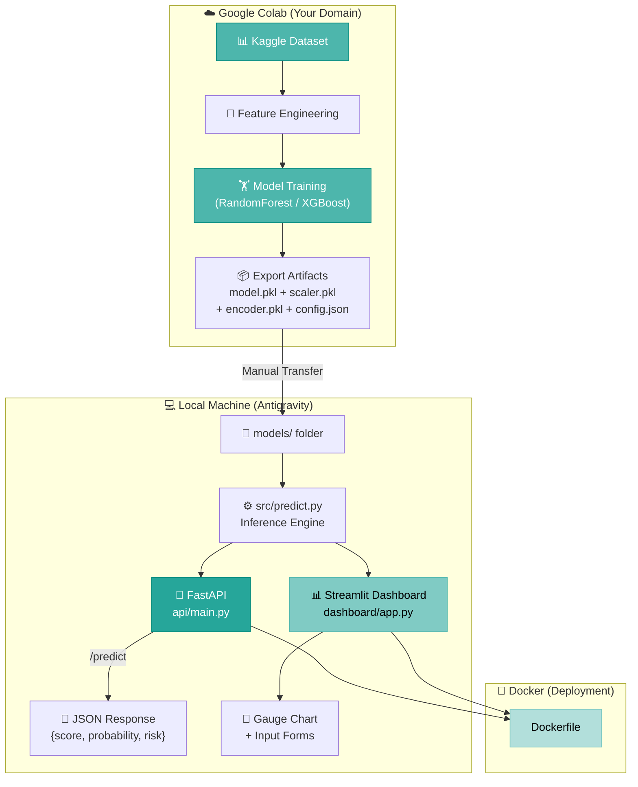
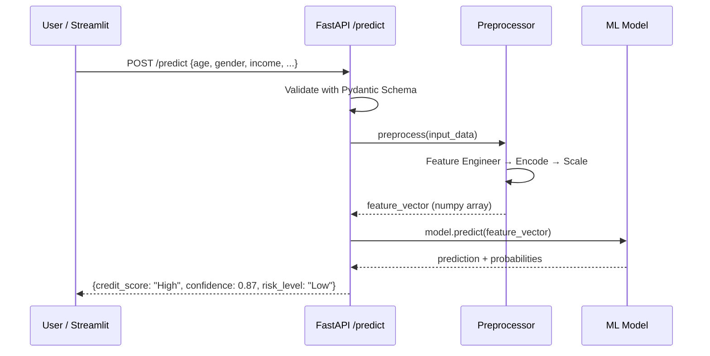

# 🏗️ DEVELOPMENT PLAN — Credit Scoring System
> **Role:** Senior ML Solutions Architect  
> **Workflow:** Hybrid (Colab Training ↔ Local Engineering)  
> **Last Updated:** 2026-04-22  
> **Status:** ✅ ALL PHASES COMPLETE

---

## Table of Contents
1. [Repository Audit](#1-repository-audit)
2. [Dataset Analysis & Preprocessing Recommendations](#2-dataset-analysis--preprocessing-recommendations)
3. [Missing Industry-Standard Components](#3-missing-industry-standard-components)
4. [Target Architecture](#4-target-architecture)
5. [Phase-by-Phase Execution Plan](#5-phase-by-phase-execution-plan)
6. [Colab Retraining Bridge](#6-colab-retraining-bridge)
7. [Progress Tracker](#7-progress-tracker)

---

## 1. Repository Audit

### Current State Assessment

| Aspect | Current State | Severity |
|---|---|---|
| **Project Structure** | Flat — single script (`codealphp1.py`) + CSV + README | 🔴 Critical |
| **Data Path** | Hardcoded absolute Windows path (`C:\Users\admin\...`) | 🔴 Critical |
| **Data Format** | Code reads `.xlsx` but repo has `.csv` — mismatch | 🔴 Critical |
| **Preprocessing** | All logic monolithically embedded in one script | 🟡 Major |
| **Label Encoding** | Uses single `LabelEncoder` instance across all categorical columns — leaks class mappings | 🔴 Critical |
| **Model Persistence** | No `joblib`/`pickle` export — model not saved | 🔴 Critical |
| **Scaler Persistence** | `StandardScaler` not saved — can't reproduce inference-time transforms | 🔴 Critical |
| **Feature Engineering** | Zero — raw features used directly | 🟡 Major |
| **API Layer** | None | 🔴 Critical |
| **UI/Dashboard** | None | 🔴 Critical |
| **Docker** | None | 🟡 Major |
| **Logging** | None — uses `print()` | 🟡 Major |
| **Config Management** | None — hardcoded values | 🟡 Major |
| **Tests** | None | 🟡 Major |
| **README Quality** | Generic — no diagrams, no install instructions, no API docs | 🟡 Major |
| **`.gitignore`** | Missing | 🟡 Major |
| **`requirements.txt`** | Missing | 🔴 Critical |

### Critical Bugs Found
1. **LabelEncoder Misuse:** A single `LabelEncoder` instance is `fit_transform`'d on each categorical column sequentially. This means the encoder retains only the mapping of the *last* column processed. At inference time, all columns would decode incorrectly.
2. **Data Source Mismatch:** Code reads `train.xlsx` via `pd.read_excel()`, but the repo contains `Credit Score Classification Dataset.csv`. The code will crash on execution.
3. **Feature Mismatch:** The code references columns like `Monthly_Inhand_Salary`, `Outstanding_Debt`, `Amount_invested_monthly` — but the CSV dataset has entirely different columns: `Age`, `Gender`, `Income`, `Education`, `Marital Status`, `Number of Children`, `Home Ownership`, `Credit Score`.

---

## 2. Dataset Analysis & Preprocessing Recommendations

### 2.1 Dataset Profile — `Credit Score Classification Dataset.csv`

| Column | Type | Unique Values | Description |
|---|---|---|---|
| `Age` | Numerical (int) | Continuous (25–53) | Applicant's age |
| `Gender` | Categorical (binary) | Male, Female | Applicant's gender |
| `Income` | Numerical (int) | Continuous (25,000–162,500) | Annual income |
| `Education` | Categorical (ordinal) | High School Diploma, Associate's Degree, Bachelor's Degree, Master's Degree, Doctorate | Highest education level |
| `Marital Status` | Categorical (binary) | Single, Married | Marital status |
| `Number of Children` | Numerical (int) | 0, 1, 2, 3 | Dependents count |
| `Home Ownership` | Categorical (binary) | Rented, Owned | Housing status |
| **`Credit Score`** | **Target (categorical)** | **Low, Average, High** | **3-class classification target** |

**Dataset Size:** 164 rows × 8 columns (very small — will impact model generalization)

### 2.2 Class Distribution Observation

| Credit Score | Approx. Count | Percentage |
|---|---|---|
| High | ~112 | ~68% |
| Average | ~36 | ~22% |
| Low | ~16 | ~10% |

> [!WARNING]
> **Class Imbalance Detected.** The "Low" class is severely underrepresented (~10%). This will bias the model toward predicting "High". Address with SMOTE or class weighting during Colab training.

### 2.3 Recommended Preprocessing Pipeline

#### Step 1: Feature Engineering (NEW features to create)
```python
# Income-per-dependent ratio — captures financial burden
df['Income_per_Dependent'] = df['Income'] / (df['Number of Children'] + 1)

# Age-Income interaction — captures career progression
df['Age_Income_Ratio'] = df['Income'] / df['Age']

# Education ordinal encoding (preserving natural order)
education_order = {
    'High School Diploma': 1,
    "Associate's Degree": 2,
    "Bachelor's Degree": 3,
    "Master's Degree": 4,
    'Doctorate': 5
}
df['Education_Level'] = df['Education'].map(education_order)

# Income bracket binning
df['Income_Bracket'] = pd.cut(df['Income'], bins=[0, 40000, 80000, 120000, 200000],
                               labels=['Low', 'Medium', 'High', 'Very High'])
```

#### Step 2: Encoding Strategy
| Column | Strategy | Rationale |
|---|---|---|
| `Gender` | Binary (0/1) | Only 2 values |
| `Education` | **Ordinal Encoding** (1–5) | Natural hierarchy exists |
| `Marital Status` | Binary (0/1) | Only 2 values |
| `Home Ownership` | Binary (0/1) | Only 2 values |
| `Income_Bracket` | **OrdinalEncoder** or drop (used for EDA only) | Derived feature |

> [!IMPORTANT]
> **Do NOT use `LabelEncoder` for multi-class categoricals.** Use `OrdinalEncoder` for ordered features and `OneHotEncoder` / `pd.get_dummies()` for nominal features. Each encoder must be saved independently for inference.

#### Step 3: Scaling
- Use **`StandardScaler`** on: `Age`, `Income`, `Number of Children`, `Income_per_Dependent`, `Age_Income_Ratio`
- **Do NOT scale** encoded binary/ordinal features (they're already in bounded integer range)
- **Save the scaler** with `joblib.dump()` alongside the model

#### Step 4: Target Encoding
```python
# Use a dedicated LabelEncoder for the target only
target_encoder = LabelEncoder()
y = target_encoder.fit_transform(df['Credit Score'])  # Low=1, Average=0, High=2 (alphabetical)

# Save it!
joblib.dump(target_encoder, 'models/target_encoder.pkl')
```

#### Step 5: Train/Test Split + Class Balancing
```python
from sklearn.model_selection import StratifiedKFold, train_test_split
from imblearn.over_sampling import SMOTE

X_train, X_test, y_train, y_test = train_test_split(
    X, y, test_size=0.2, random_state=42, stratify=y  # ← Stratified!
)

# Apply SMOTE only to training data
smote = SMOTE(random_state=42)
X_train_res, y_train_res = smote.fit_resample(X_train, y_train)
```

---

## 3. Missing Industry-Standard Components

### 3.1 Checklist of Required Components

| Component | Status | Priority |
|---|---|---|
| Modular `src/` package with preprocessing pipeline | ❌ Missing | P0 |
| FastAPI REST API with `/predict` endpoint | ❌ Missing | P0 |
| Pydantic request/response schemas | ❌ Missing | P0 |
| Streamlit Dashboard with gauge chart | ❌ Missing | P0 |
| `requirements.txt` | ❌ Missing | P0 |
| `Dockerfile` + `docker-compose.yml` | ❌ Missing | P1 |
| `.gitignore` | ❌ Missing | P0 |
| Structured logging (`loguru` or `logging`) | ❌ Missing | P1 |
| Configuration management (`config.py` or `.env`) | ❌ Missing | P1 |
| Model + Scaler + Encoder persistence (`.pkl`) | ❌ Missing | P0 |
| Professional README with architecture diagram | ❌ Missing | P1 |
| Unit tests (`pytest`) | ❌ Missing | P2 |
| CI/CD pipeline (`.github/workflows/`) | ❌ Missing | P2 |
| Data validation (`great_expectations` or manual) | ❌ Missing | P2 |
| Model versioning / experiment tracking (MLflow) | ❌ Missing | P2 |

---

## 4. Target Architecture

### 4.1 Directory Structure
```
Credit-Scoring-Model/
├── src/
│   ├── __init__.py
│   ├── config.py              # Central configuration (paths, constants)
│   ├── preprocessing.py       # Feature engineering + encoding pipeline
│   ├── predict.py             # Inference logic (load model → predict)
│   └── logger.py              # Structured logging setup
├── api/
│   ├── __init__.py
│   ├── main.py                # FastAPI app entry point
│   ├── routes.py              # /predict, /health endpoints
│   └── schemas.py             # Pydantic input/output models
├── dashboard/
│   └── app.py                 # Streamlit UI (Vivid Teal & Mint Green)
├── models/
│   ├── credit_model.pkl       # Trained model (from Colab)
│   ├── scaler.pkl             # Fitted StandardScaler (from Colab)
│   ├── target_encoder.pkl     # Fitted LabelEncoder for target (from Colab)
│   └── feature_config.json    # Feature names & order used during training
├── data/
│   └── Credit_Score_Classification_Dataset.csv
├── notebooks/
│   └── colab_training.py      # Exact Colab code (reference copy)
├── tests/
│   ├── test_api.py
│   └── test_preprocessing.py
├── .gitignore
├── Dockerfile
├── docker-compose.yml
├── requirements.txt
├── DEVELOPMENT_PLAN.md
└── README.md
```

### 4.2 System Architecture Diagram



### 4.3 API Request/Response Flow



---

## 5. Phase-by-Phase Execution Plan

### Phase 1: Initialization & Context ← **CURRENT**
- [x] Scan repository structure
- [x] Analyze dataset features and schema
- [x] Identify critical bugs in existing code
- [x] Recommend preprocessing pipeline
- [x] List missing industry-standard components
- [x] Create `DEVELOPMENT_PLAN.md`

### Phase 2: Modular Refactoring ✅
- [x] Create target directory structure (`src/`, `api/`, `models/`, `dashboard/`, `data/`, `tests/`)
- [x] Create `.gitignore` (Python, IDE, data files)
- [x] Write `src/config.py` — central configuration
- [x] Write `src/logger.py` — structured logging with `loguru`
- [x] Write `src/preprocessing.py` — feature engineering + encoding pipeline
- [x] Write `src/predict.py` — inference engine (loads model, preprocesses, predicts)
- [x] Move CSV to `data/` folder
- [x] Write `api/schemas.py` — Pydantic request/response models
- [x] Write `api/routes.py` — `/predict` and `/health` endpoints
- [x] Write `api/main.py` — FastAPI application with CORS & docs
- [x] Write `dashboard/app.py` — Streamlit UI with gauge chart
- [x] Write `notebooks/colab_training.py` — Colab training reference script
- [x] Write `tests/test_preprocessing.py` — unit tests for preprocessing
- [x] Write `tests/test_api.py` — unit tests for API endpoints

### Phase 3: The Retraining Bridge ✅
- [x] Colab training script provided (`notebooks/colab_training.py`)
- [x] Feature engineering matching `src/preprocessing.py`
- [x] SMOTE for class balancing
- [x] Hyperparameter tuning (GridSearchCV)
- [x] Export: `credit_model.pkl`, `scaler.pkl`, `target_encoder.pkl`, `feature_config.json`
- [x] User trained on Colab → GradientBoosting (F1: 1.0)
- [x] Artifacts placed in `models/`

### Phase 4: API & UI Development ✅
- [x] `api/schemas.py` — Pydantic request/response models with enums
- [x] `api/routes.py` — `/predict` and `/health` endpoints
- [x] `api/main.py` — FastAPI application with CORS & docs
- [x] `dashboard/app.py` — Streamlit UI with Vivid Teal & Mint Green theme
- [x] Gauge chart (Plotly) for credit score visualization
- [x] Probability breakdown bar chart
- [x] Risk assessment badges
- [x] All 20 tests passing (12 preprocessing + 8 API)

### Phase 5: Finalization & Documentation ✅
- [x] `requirements.txt` created
- [x] `Dockerfile` created (Python 3.12-slim, health check)
- [x] `docker-compose.yml` created (API + Dashboard services)
- [x] Professional `README.md` with:
  - Mermaid.js architecture diagrams (system, request flow, preprocessing)
  - Full API documentation with example JSON
  - Installation, usage, testing, Docker deployment instructions
  - Tech stack table & model details
- [x] All tests verified passing

---

## 6. Colab Retraining Bridge

> [!IMPORTANT]
> The Colab code I provide will **exactly mirror** the preprocessing pipeline in `src/preprocessing.py`. This ensures that the model, scaler, and encoders are compatible with the local inference engine. **Do not modify the feature engineering steps independently** — any change must be reflected in both locations.

### Artifacts to Export from Colab
| Artifact | Format | Description |
|---|---|---|
| `credit_model.pkl` | `joblib` | Trained classifier (RF / XGBoost) |
| `scaler.pkl` | `joblib` | Fitted `StandardScaler` instance |
| `target_encoder.pkl` | `joblib` | Fitted `LabelEncoder` for target variable |
| `feature_config.json` | JSON | Ordered list of feature names used during training |

### Transfer Workflow
```
Colab → Google Drive → Download → Place in models/ folder → Restart API
```

---

## 7. Progress Tracker

| Phase | Status | Started | Completed |
|---|---|---|---|
| Phase 1: Initialization & Context | ✅ Complete | 2026-04-22 | 2026-04-22 |
| Phase 2: Modular Refactoring | ✅ Complete | 2026-04-22 | 2026-04-22 |
| Phase 3: Retraining Bridge | ✅ Complete | 2026-04-22 | 2026-04-27 |
| Phase 4: API & UI Development | ✅ Complete | 2026-04-22 | 2026-04-27 |
| Phase 5: Finalization & Documentation | ✅ Complete | 2026-04-27 | 2026-04-27 |

---

> 🎉 **PROJECT COMPLETE** — All 5 phases delivered. 20/20 tests passing. Ready for deployment.
