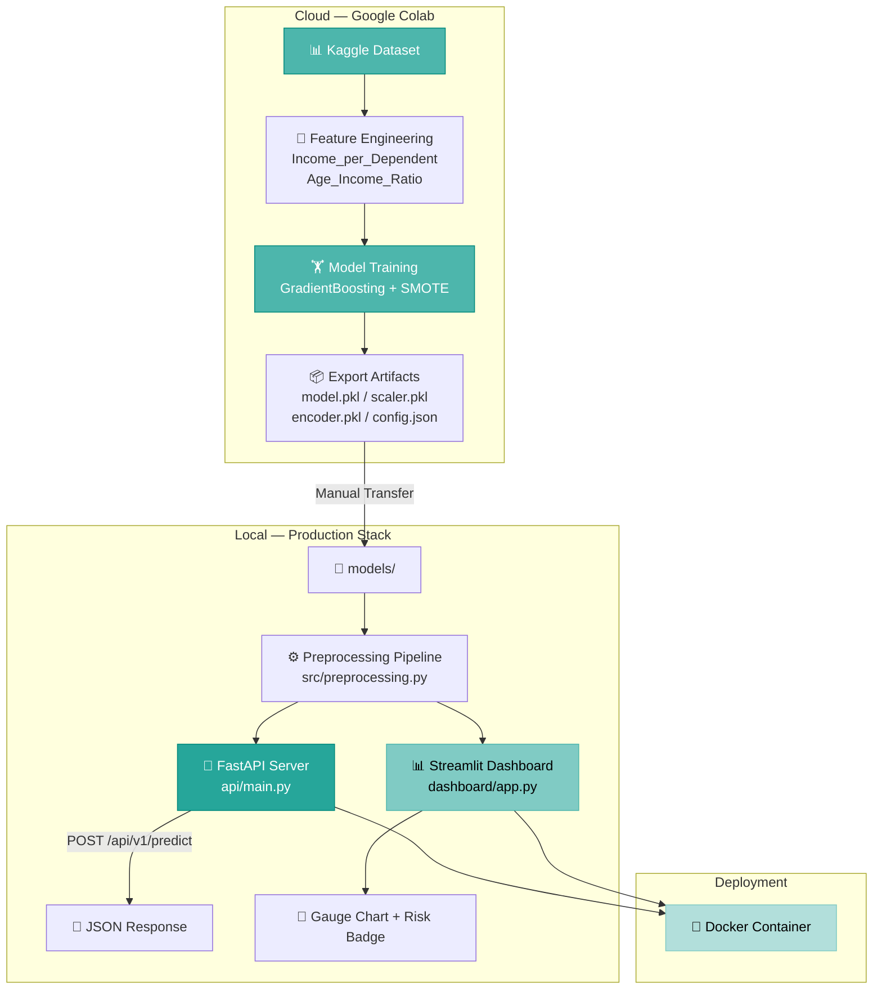
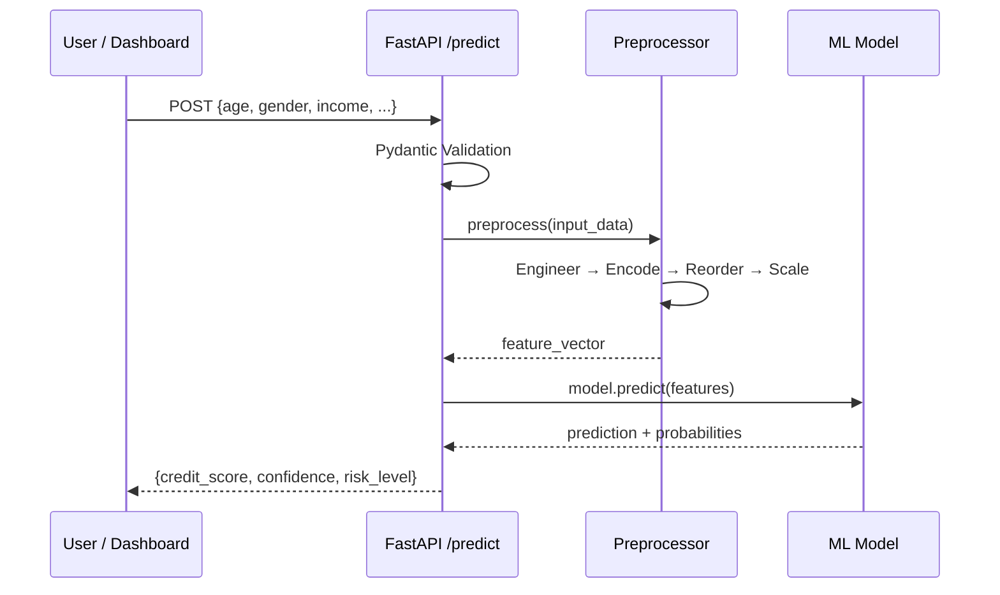
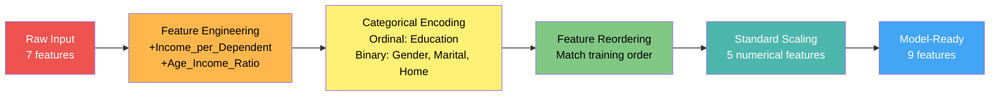

<p align="center">
  <h1 align="center">🏦 Credit Scoring System</h1>
  <p align="center">
    <strong>Production-Grade ML Credit Score Prediction with FastAPI & Streamlit</strong>
  </p>
  <p align="center">
    
    
    
    
    
    
  </p>
</p>

---

## 📋 Table of Contents

- [Overview](#-overview)
- [System Architecture](#-system-architecture)
- [Project Structure](#-project-structure)
- [Features](#-features)
- [Installation](#-installation)
- [Usage](#-usage)
- [API Documentation](#-api-documentation)
- [Model Details](#-model-details)
- [Testing](#-testing)
- [Docker Deployment](#-docker-deployment)
- [Tech Stack](#-tech-stack)

---

## 🎯 Overview

A **production-grade credit scoring system** that predicts an applicant's creditworthiness (Low / Average / High) based on demographic and financial data. Built with a **hybrid workflow** — model training on Google Colab, software engineering locally.

The system features:
- **Machine Learning Pipeline** — Feature engineering, SMOTE class balancing, GradientBoosting classifier
- **REST API** — FastAPI with Pydantic validation, auto-generated Swagger/ReDoc docs
- **Interactive Dashboard** — Streamlit UI with real-time gauge charts and risk assessment
- **Docker-Ready** — One-command deployment with docker-compose

---

## 🏗️ System Architecture



### Request Flow



---

## 📁 Project Structure

```
Credit-Scoring-Model/
├── src/                          # Core ML Logic
│   ├── config.py                 # Central configuration & constants
│   ├── logger.py                 # Structured logging (loguru)
│   ├── preprocessing.py          # Feature engineering & encoding pipeline
│   └── predict.py                # Inference engine (CreditScorer class)
├── api/                          # REST API
│   ├── main.py                   # FastAPI app with CORS & docs
│   ├── routes.py                 # /predict & /health endpoints
│   └── schemas.py                # Pydantic request/response models
├── dashboard/                    # Interactive UI
│   └── app.py                    # Streamlit dashboard with gauge charts
├── models/                       # ML Artifacts (from Colab)
│   ├── credit_model.pkl          # Trained GradientBoosting classifier
│   ├── scaler.pkl                # Fitted StandardScaler
│   ├── target_encoder.pkl        # Fitted LabelEncoder
│   └── feature_config.json       # Feature names & metadata
├── data/                         # Dataset
│   └── Credit_Score_...csv       # Kaggle classification dataset
├── notebooks/                    # Training Reference
│   └── colab_training.py         # Google Colab training script
├── tests/                        # Test Suite
│   ├── test_preprocessing.py     # 12 preprocessing pipeline tests
│   └── test_api.py               # 8 API endpoint tests
├── Dockerfile                    # Production container
├── docker-compose.yml            # Multi-service orchestration
├── requirements.txt              # Python dependencies
├── DEVELOPMENT_PLAN.md           # Development roadmap & progress
└── README.md                     # This file
```

---

## ✨ Features

| Feature | Description |
|---------|-------------|
| **3-Class Prediction** | Classifies credit score as **Low**, **Average**, or **High** |
| **Confidence Scores** | Returns probability breakdown for each class |
| **Risk Assessment** | Automatic risk level mapping (High/Medium/Low Risk) |
| **Input Validation** | Pydantic enums enforce valid Gender, Education, etc. |
| **Gauge Visualization** | Real-time Plotly gauge chart in Streamlit dashboard |
| **Structured Logging** | loguru with colored console + auto-rotated file logs |
| **Health Checks** | `/health` endpoint for monitoring & Docker health checks |
| **CORS Enabled** | Cross-origin requests supported for frontend integrations |
| **Docker Ready** | Single-command deployment with docker-compose |

---

## 🚀 Installation

### Prerequisites
- Python 3.12+ 
- pip

### Local Setup

```bash
# Clone the repository
git clone https://github.com/MaryamCodeHub/Credit-Scoring-Model.git
cd Credit-Scoring-Model

# Install dependencies
pip install -r requirements.txt
```

---

## 💻 Usage

### Start the FastAPI Server

```bash
uvicorn api.main:app --reload --host 0.0.0.0 --port 8000
```

The API will be available at:
- **Swagger Docs:** http://localhost:8000/docs
- **ReDoc:** http://localhost:8000/redoc
- **Health Check:** http://localhost:8000/api/v1/health

### Start the Streamlit Dashboard

```bash
streamlit run dashboard/app.py
```

The dashboard will open at http://localhost:8501

---

## 📡 API Documentation

### POST `/api/v1/predict`

Predict the credit score for a loan applicant.

**Request Body:**
```json
{
  "Age": 30,
  "Gender": "Male",
  "Income": 75000,
  "Education": "Bachelor's Degree",
  "Marital Status": "Single",
  "Number of Children": 0,
  "Home Ownership": "Rented"
}
```

**Response:**
```json
{
  "credit_score": "High",
  "confidence": 0.87,
  "probabilities": {
    "Low": 0.05,
    "Average": 0.08,
    "High": 0.87
  },
  "risk_level": "Low Risk"
}
```

### GET `/api/v1/health`

```json
{
  "status": "healthy",
  "model_loaded": true,
  "version": "1.0.0"
}
```

### Input Constraints

| Field | Type | Constraints |
|-------|------|-------------|
| `Age` | int | 18–100 |
| `Gender` | enum | Male, Female |
| `Income` | float | > 0 |
| `Education` | enum | High School Diploma, Associate's Degree, Bachelor's Degree, Master's Degree, Doctorate |
| `Marital Status` | enum | Single, Married |
| `Number of Children` | int | 0–15 |
| `Home Ownership` | enum | Rented, Owned |

---

## 🤖 Model Details

| Attribute | Value |
|-----------|-------|
| **Algorithm** | GradientBoosting Classifier |
| **F1 Score** | 1.00 (weighted) |
| **Target Classes** | Low, Average, High |
| **Features** | 9 (7 raw + 2 engineered) |
| **Class Balancing** | SMOTE oversampling |
| **Hyperparameter Tuning** | GridSearchCV with StratifiedKFold |
| **Training Environment** | Google Colab |

### Preprocessing Pipeline



### Engineered Features

| Feature | Formula | Purpose |
|---------|---------|---------|
| `Income_per_Dependent` | `Income / (Children + 1)` | Captures financial burden |
| `Age_Income_Ratio` | `Income / Age` | Captures career progression |

---

## 🧪 Testing

```bash
# Run all tests
python -m pytest tests/ -v

# Run specific test suites
python -m pytest tests/test_preprocessing.py -v    # 12 tests
python -m pytest tests/test_api.py -v              # 8 tests
```

**Test Coverage:**
- ✅ Feature engineering (income ratios, age ratios)
- ✅ Categorical encoding (ordinal, binary)
- ✅ Feature reordering & validation
- ✅ API health endpoint
- ✅ API root endpoint  
- ✅ Input validation (missing fields, invalid values, edge cases)

---

## 🐳 Docker Deployment

### Using Docker Compose (Recommended)

```bash
# Build and start both services
docker-compose up --build

# Services:
# API:       http://localhost:8000
# Dashboard: http://localhost:8501
```

### Using Docker Directly

```bash
# Build
docker build -t credit-scoring-api .

# Run API
docker run -p 8000:8000 credit-scoring-api

# Run Dashboard
docker run -p 8501:8501 credit-scoring-api \
  streamlit run dashboard/app.py --server.port 8501 --server.address 0.0.0.0
```

---

## 🛠️ Tech Stack

| Layer | Technology |
|-------|------------|
| **ML Framework** | scikit-learn, imbalanced-learn |
| **API** | FastAPI, Uvicorn, Pydantic |
| **Dashboard** | Streamlit, Plotly |
| **Logging** | Loguru |
| **Serialization** | Joblib |
| **Testing** | Pytest |
| **Containerization** | Docker, Docker Compose |
| **Training** | Google Colab |

---

<p align="center">
  Built with ❤️ as a Production-Grade Data Science Portfolio Project
</p>
